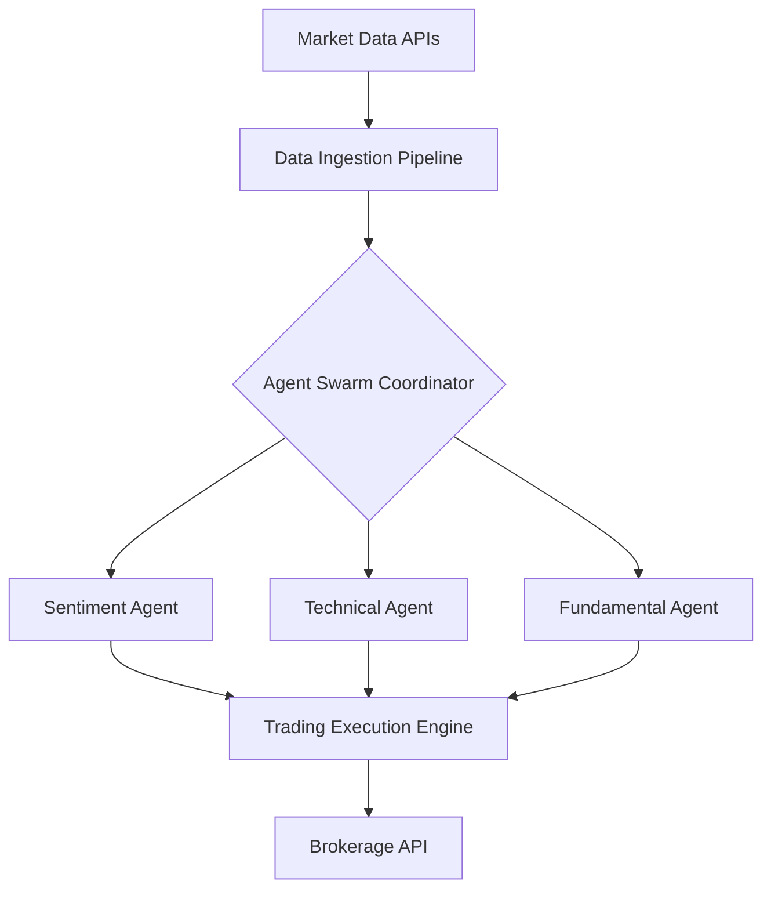

# AI-Native Hedge Fund & Trading Swarm


## 📖 Overview
The **AI-Native Hedge Fund & Trading Swarm** is an experimental quantitative finance platform that uses a multi-agent "swarm" of Large Language Models (LLMs) and statistical models to execute live market evaluations, discover alpha, and deploy automated trading strategies.

## ✨ Key Features
- **Multi-Agent Swarm:** Specialized agents for sentiment analysis, technical analysis, and fundamental evaluation working in concensus.
- **Real-Time Market Alpha:** Ingests live news feeds, Twitter sentiment, and SEC filings to generate actionable trading signals.
- **Risk Management Protocol:** Hard-coded financial risk limits (e.g., max drawdown, position sizing) to override rogue AI confidence.
- **Backtesting Engine:** Fast, historical tick-level backtesting simulator to validate agent strategies before live deployment.

## 🏗 System Architecture


## 📂 Repository Structure
- `ai_engine/`: Multi-agent swarm implementation and strategy prompts.
- `backend/`: Fast execution server and real-time WebSocket data feeds.
- `infra/`: Low-latency deployment configurations.

## 🚀 Getting Started

### Local Development
1. Clone the repository and install dependencies:
   ```bash
   pip install -r requirements.txt
   ```
2. Configure your broker API keys and LLM providers in `.env`.
3. Start the trading orchestrator:
   ```bash
   uvicorn backend.main:app --host 0.0.0.0 --port 8000
   ```
4. Access the Swarm Dashboard at `http://localhost:8000/docs`.

### Docker Deployment
```bash
docker build -t quant-swarm:latest -f infra/Dockerfile .
docker run --env-file .env -p 8000:8000 quant-swarm:latest
```

## 🛠 Known Issues
- Needs live market data integration tests.

## 🤝 Contributing
Pull requests must pass all quantitative unit tests and rigorous backtesting constraints.
